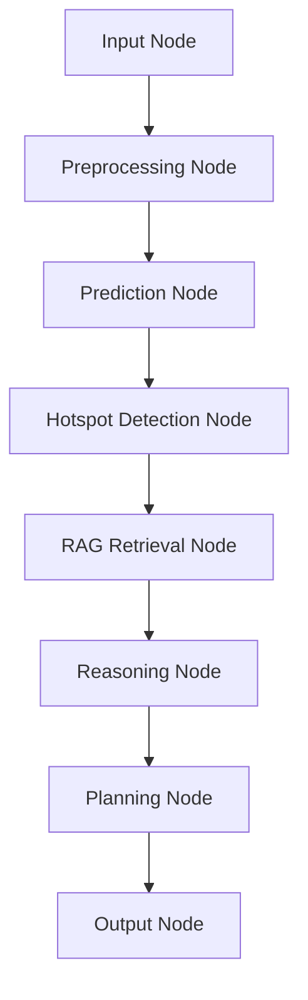
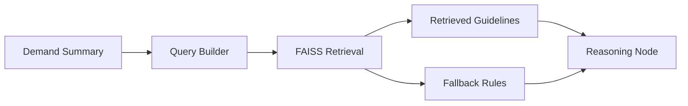

# Intelligent EV Charging Demand Prediction and Agentic Infrastructure Planning

[Live Demo](https://ev-charging-demand-prediction-2026.streamlit.app/#4fdf7da3) | [Project Report](https://www.overleaf.com/read/gzkncnjwyhdh#29da89) | [Requirements](requirements.txt) | [App Entry](app/streamlit_app.py)

## Quick Navigation

- [Project Overview](#project-overview)
- [Why This Project Matters](#why-this-project-matters)
- [System Architecture](#system-architecture)
- [LangGraph Agent Workflow](#langgraph-agent-workflow)
- [Input and Output Specification](#input-and-output-specification)
- [Repository Structure](#repository-structure)
- [Model Performance](#model-performance)
- [Optimization and Planning Logic](#optimization-and-planning-logic)
- [RAG and Robustness Design](#rag-and-robustness-design)
- [UI and Demo Flow](#ui-and-demo-flow)
- [Installation and Run Instructions](#installation-and-run-instructions)
- [Deployment](#deployment)
- [Report and Video](#report-and-video)
- [Rubric Alignment](#rubric-alignment)

## Project Overview

This project addresses EV charging infrastructure planning as a two-layer AI system:

1. A machine learning layer forecasts hourly charging demand from historical station usage.
2. A stateful LangGraph agent layer interprets forecast patterns, retrieves planning guidelines through RAG, and generates explainable infrastructure and scheduling recommendations.

The current repository is the end-semester agentic version of the project. It extends the original forecasting pipeline into a production-oriented planning assistant with:

- demand prediction
- hotspot detection
- LangGraph state transitions
- FAISS-based retrieval
- optimization-aware reasoning
- robust failure handling
- Streamlit-based decision support UI

## Why This Project Matters

EV infrastructure planning is not only a forecasting problem. Operators also need to answer questions such as:

- Which stations are likely to face peak congestion?
- How many chargers should be deployed without overbuilding?
- When is load balancing required to avoid transformer stress?
- Which hours should be incentivized as off-peak windows?

This system is designed to move from raw usage analytics to explainable planning recommendations that are useful for real-world grid and station operations.

## System Architecture

The end-to-end system combines ML forecasting, agentic reasoning, retrieval, and UI delivery.


### Architecture Summary

| Layer | Responsibility | Main Files |
| --- | --- | --- |
| Input Layer | Accept uploaded CSV and station selection | [ui/streamlit_app.py](ui/streamlit_app.py) |
| Validation Layer | Validate schema, impute partial inputs, detect weak signals | [utils/validation.py](utils/validation.py) |
| ML Layer | Load trained model, generate demand forecasts, compute evaluation metrics | [ml/inference.py](ml/inference.py), [ml/evaluation.py](ml/evaluation.py) |
| Agent Layer | Maintain explicit state and execute node-based workflow | [agent/workflow.py](agent/workflow.py), [agent/state.py](agent/state.py) |
| Retrieval Layer | Load FAISS index and fetch infrastructure guidelines | [rag/vectorstore.py](rag/vectorstore.py), [rag/ingest.py](rag/ingest.py) |
| Planning Layer | Optimize charger count, scheduling, utilization, and grid safety | [agent/workflow.py](agent/workflow.py) |
| UI Layer | Present metrics, reasoning, plan, warnings, and structured output | [ui/streamlit_app.py](ui/streamlit_app.py) |

## LangGraph Agent Workflow

This system uses a LangGraph-based stateful agent workflow.



### State Object

The agent state explicitly tracks the following information across node transitions:

| State Field | Purpose |
| --- | --- |
| `raw_data` | Uploaded station data selected for analysis |
| `processed_data` | Model-ready and imputed feature frame |
| `predictions` | Forecasted hourly demand values |
| `hotspots` | High-load hours detected from forecast outputs |
| `retrieved_docs` | Retrieved planning guidelines or fallback rules |
| `reasoning` | Intermediate optimization and planning insights |
| `final_plan` | Structured infrastructure and scheduling output |
| `summary` | Average demand, peak demand, peak hour, risk level |
| `errors` | Critical issues surfaced to the UI |
| `warnings` | Non-fatal issues such as imputations or retrieval fallback |

### Execution Logic

| Node | What It Does |
| --- | --- |
| Input Node | Filters the uploaded dataset to the chosen station and initializes workflow state |
| Preprocessing Node | Converts features to numeric, imputes missing values, and performs data quality checks |
| Prediction Node | Runs the trained ML model and produces demand forecasts |
| Hotspot Detection Node | Identifies peak-load windows from grouped hourly forecasts |
| RAG Retrieval Node | Retrieves infrastructure planning guidelines from FAISS |
| Reasoning Node | Applies utilization, cost, smoothing, and grid-constraint reasoning |
| Planning Node | Produces chargers, schedule, load balancing, and recommendations |
| Output Node | Formats a consistent final payload for the UI |

## Input and Output Specification

### Input

| Field | Required | Description |
| --- | --- | --- |
| `station_encoded` | Yes | Numeric station identifier used by the trained model |
| `hour` | Yes | Hour of day for each record |
| `dayofweek` | No | Calendar feature used if available |
| `month` | No | Calendar feature used if available |
| `day` | No | Calendar feature used if available |
| `weekofyear` | No | Calendar feature used if available |
| `hour_sin`, `hour_cos` | No | Cyclical time encoding |
| `dow_sin`, `dow_cos` | No | Cyclical weekday encoding |
| `lag_1` | No | Previous hour demand signal |
| `rolling_3h`, `rolling_24h` | No | Short and medium-term rolling demand indicators |

If optional fields are missing, the system imputes defaults and continues with warnings instead of crashing.

### Output

| Output | Description |
| --- | --- |
| `predictions` | Forecasted hourly demand records |
| `avg_demand` | Average forecast demand for the selected station |
| `peak_demand` | Highest forecast demand value |
| `peak_hour` | Hour at which peak demand occurs |
| `hotspots` | High-load hours surfaced as risk windows |
| `infrastructure_plan` | Charger count, charger type, utilization target, load-balancing status |
| `schedule` | Non-overlapping peak and off-peak strategy |
| `recommendations` | Actionable planning guidance |
| `reasoning` | Explainable trade-off analysis |
| `errors` and `warnings` | Safe failure and degradation feedback |

## Repository Structure

| Directory | Purpose | Link |
| --- | --- | --- |
| `agent/` | LangGraph workflow, state definition, workflow entrypoints | [agent/](agent/) |
| `app/` | Backward-compatible app entrypoint | [app/](app/) |
| `ml/` | Inference configuration and model evaluation logic | [ml/](ml/) |
| `rag/` | FAISS retrieval and guideline ingestion | [rag/](rag/) |
| `ui/` | Streamlit application UI | [ui/](ui/) |
| `utils/` | Validation, contracts, and shared logging | [utils/](utils/) |
| `src/` | Original ML pipeline utilities retained for compatibility | [src/](src/) |
| `data/` | Raw and processed datasets | [data/](data/) |
| `models/` | Saved trained models | [models/](models/) |
| `reports/` | Report assets and LaTeX materials | [reports/](reports/) |

### Key Files

| File | Purpose |
| --- | --- |
| [ui/streamlit_app.py](ui/streamlit_app.py) | Main Streamlit UI |
| [agent/workflow.py](agent/workflow.py) | LangGraph node definitions and planning logic |
| [agent/graph.py](agent/graph.py) | Graph builder and workflow runner |
| [agent/state.py](agent/state.py) | Explicit state contract |
| [ml/evaluation.py](ml/evaluation.py) | MAE, RMSE, R² computation from held-out data |
| [ml/inference.py](ml/inference.py) | Prediction wrapper with failure handling |
| [utils/validation.py](utils/validation.py) | CSV validation, imputation, data quality logic |
| [rag/vectorstore.py](rag/vectorstore.py) | Guideline retrieval and fallback behavior |
| [requirements.txt](requirements.txt) | Dependency list |

## Model Performance

The forecasting layer uses the processed hourly dataset and a chronological 80/20 split for evaluation.

### Current Held-Out Metrics

| Metric | Value | Interpretation |
| --- | --- | --- |
| MAE | 4.13 | Average absolute forecast error is about 4.13 kWh |
| RMSE | 6.08 | Larger errors are penalized more strongly |
| R² Score | 0.690 | The model explains approximately 69.0% of the variance in held-out demand |

### Model Comparison

| Rank | Model | MAE | RMSE | R² |
| --- | --- | --- | --- | --- |
| 1 | Linear Regression Pipeline | 4.1284 | 6.0836 | 0.6897 |
| 2 | Random Forest Regressor | 4.2238 | 6.3989 | 0.6567 |
| 3 | Gradient Boosting Regressor | 4.2818 | 6.4563 | 0.6506 |
| 4 | LightGBM Regressor | 4.4232 | 6.8204 | 0.6100 |

### Evaluation Notes

- The best exported model is [models/best_ev_demand_model.pkl](models/best_ev_demand_model.pkl).
- Metrics are surfaced in the UI through [ml/evaluation.py](ml/evaluation.py).
- The test set contains 2722 held-out rows based on chronological split.

## Optimization and Planning Logic

The planning layer is not a simple `peak_demand / 10` rule. It explicitly reasons over utilization, cost, peak smoothing, and grid safety.

### Decision Factors

| Factor | How It Is Used |
| --- | --- |
| Charger utilization | Target band is approximately 70% to 90% to avoid underuse and excessive queuing |
| Cost vs performance | More chargers reduce queue risk but raise idle infrastructure cost |
| Peak smoothing | Scheduling shifts discretionary charging away from the highest-load hour |
| Grid constraints | Forecasts above 25 kWh trigger load-balancing logic |
| Charger type selection | Charger profile changes with forecast intensity |

### Planning Output Example

| Output Element | Example Interpretation |
| --- | --- |
| Charger Count | Chosen because utilization remains close to target band |
| Charger Type | Selected from Level 2 AC, Hybrid AC/DC, or DC Fast based on demand intensity |
| Load Balancing | Enabled when peak demand risks transformer stress |
| Schedule | Peak and off-peak windows are explicitly separated to avoid overlap |
| Recommendations | Operational steps for pricing, balancing, and queue control |

## RAG and Robustness Design

### Retrieval Flow



### Robustness Features

| Failure Case | System Behavior |
| --- | --- |
| Missing required CSV columns | Shows a clear validation error with required field names |
| Missing optional features | Imputes defaults and continues with warnings |
| Invalid numeric feature values | Coerces and imputes values instead of crashing |
| Model prediction failure | Returns safe prediction failure message |
| No RAG documents retrieved | Uses fallback guideline text and sets `rag_fallback_used = true` |
| Weak trend signal or too few records | Returns “Insufficient data for reliable planning” |
| Agent workflow failure | Returns a safe structured fallback response |

### Why This Matters for Deployment

The hosted application must remain stable even when:

- the uploaded CSV is incomplete
- RAG retrieval cannot load or returns no relevant result
- the selected station has weak demand history
- the model or agent pipeline encounters malformed inputs

## UI and Demo Flow

The Streamlit app is designed to be quick to understand during a demo or viva.

### UI Sections

| Section | What the User Sees |
| --- | --- |
| Architecture | System diagram and workflow explanation |
| Input and Output Specification | Clear contract for what to upload and what to expect |
| Model Performance | MAE, RMSE, and R² with interpretation |
| Executive Summary | Average demand, peak demand, peak hour, and risk level |
| Demand Forecast | Hourly trend chart for the selected station |
| Hotspots | Peak-load windows detected from forecast outputs |
| Reasoning | Explainable planning logic and optimization trade-offs |
| Infrastructure Plan | Charger count, type, utilization, and load-balancing requirement |
| Scheduling Strategy | Peak and off-peak guidance without overlap |
| Structured Output | JSON-style payload for technical review |

## Installation and Run Instructions

### Prerequisites

- Python 3.10 or higher
- `pip`
- Git

### Local Setup

```bash
git clone https://github.com/S-h-u-b-h-1/EV-charging-demand-prediction.git
cd EV-charging-demand-prediction

python -m venv venv
source venv/bin/activate

pip install -r requirements.txt
```

### Run the Streamlit App

```bash
streamlit run app/streamlit_app.py
```

### Optional Utility Runs

Rebuild the FAISS index from local guideline documents:

```bash
python rag/ingest.py
```

Recompute model evaluation metrics through the app startup path:

```bash
python -c "from ml.evaluation import load_model_metrics; print(load_model_metrics())"
```

### Environment Configuration

The current repository does not require any paid API key for the default local workflow.

| Variable | Required | Purpose |
| --- | --- | --- |
| None for default setup | Yes | The current system runs with local model artifacts and local FAISS retrieval |

If a future deployment adds an external LLM API, the README can be extended with `.env` setup, but that is not required for the current default build.

## Deployment

| Component | Status | Link |
| --- | --- | --- |
| Hosted Streamlit Demo | Available | [Open App](https://ev-charging-demand-prediction-2026.streamlit.app/#4fdf7da3) |
| Local Streamlit App | Available | `streamlit run app/streamlit_app.py` |
| RAG Vector Store | Local FAISS index included | [rag/faiss_index/](rag/faiss_index/) |

### Deployment Readiness Notes

- The app surfaces warnings and errors instead of failing silently.
- RAG fallback prevents empty retrieval from causing hallucinated planning advice.
- The UI is structured for live presentation and quick technical review.

## Report and Video

| Deliverable | Status | Link |
| --- | --- | --- |
| LaTeX Report | In progress / maintained separately | [Overleaf Report](https://www.overleaf.com/read/gzkncnjwyhdh#29da89) |
| Demo Video | To be added | Update this section with the final submission link |

### Suggested Report Coverage

- problem definition and domain context
- ML forecasting pipeline
- LangGraph workflow design
- RAG retrieval strategy
- optimization logic and planning trade-offs
- robustness and fallback handling
- qualitative example outputs

## Rubric Alignment

### End-Sem Evaluation Mapping

| Rubric Component | How This Repository Addresses It |
| --- | --- |
| Technical Implementation | LangGraph workflow, FAISS RAG, planning logic, robust UI, consistent structured outputs |
| GitHub Repository and Code Quality | Modular directories, separated agent and RAG logic, documented setup, readable file structure |
| Hosted Demo | Public Streamlit link included, UI built for live walkthrough, fallback handling added |
| Project Report | Architecture, workflow, metrics, and planning logic are documented for transfer into LaTeX report |
| Project Video | README provides a demo-ready narrative and system flow for recording |

### Milestone 2 Requirements Coverage

| Requirement | Status | Where It Appears |
| --- | --- | --- |
| LangGraph workflow and state | Implemented | [agent/workflow.py](agent/workflow.py), [agent/state.py](agent/state.py) |
| RAG with FAISS | Implemented | [rag/vectorstore.py](rag/vectorstore.py), [rag/faiss_index/](rag/faiss_index/) |
| Explicit input-output specification | Implemented | [Input and Output Specification](#input-and-output-specification) |
| System architecture diagram | Implemented | [System Architecture](#system-architecture) |
| Working UI | Implemented | [ui/streamlit_app.py](ui/streamlit_app.py) |
| Model evaluation report | Implemented | [Model Performance](#model-performance) |
| Optimization reasoning | Implemented | [Optimization and Planning Logic](#optimization-and-planning-logic) |
| Robustness and safe fallbacks | Implemented | [RAG and Robustness Design](#rag-and-robustness-design) |

## Contributors

| Name | Role |
| --- | --- |
| Rashmi | Team Member |
| Shubhaang | Team Member |
| Samiksha | Team Member |
| Ankit | Team Member |

## License

This repository is intended for academic use in the EV charging demand prediction and agentic infrastructure planning project.
